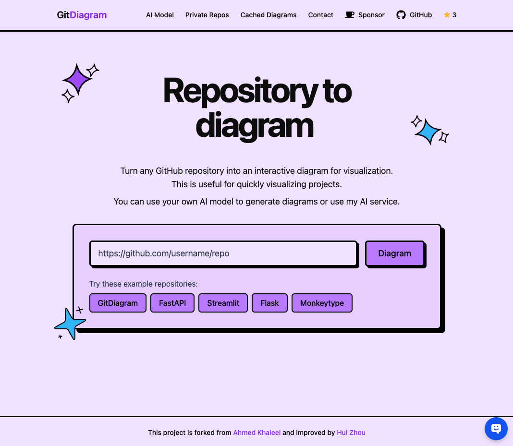

[](https://gitdiagram.com/)


[](https://buymeacoffee.com/hui.zhou)

# GitDiagram

Turn any GitHub repository into an interactive diagram for visualization in seconds.

## 🚀 Features

- 👀 **Instant Visualization**: Convert any GitHub repository structure into a system design / architecture diagram
- 🎨 **Interactivity**: Click on components to navigate directly to source files and relevant directories
- ⚡ **Fast Generation**: Powered by various AI models for quick and accurate diagrams
- 🔄 **Customization**: Modify and regenerate diagrams with custom instructions
- 🐛 **Debug Support**: View Mermaid diagram source code and syntax errors for easy debugging
- 📊 **Caching**: Generated diagrams are cached in the database to save API tokens and provide up-to-date results
- 🤖 **AI Chatbot**: Interact with the AI chatbot to get answers to your questions.

## 🤖 AI Model Configuration

- **Model Selection**: Choose from multiple LLM providers:
  - OpenRouter (default): x-ai/grok-4-fast:free
  - OpenAI: GPT-4, GPT-3.5-turbo
  - Groq: mixtral-8x7b-32768
  - Ollama: mistral, llama2, codellama
- **API Key Configuration**: Configure your own API keys for each provider through the UI
- **Context Size**: Different models have varying context windows, affecting their ability to analyze larger repositories
- **Output Variation**: The same model may generate slightly different diagrams for the same repository due to the nature of LLMs

## 💾 Caching System

- **Token Efficiency**: Generated diagrams are cached in the database to save API tokens
- **Up-to-date Results**: Cache typically reflects the latest repository state
- **Private Repositories**: Cache is stored server-side
  - For sensitive data, consider self-hosting the application
  - Self-hosting instructions provided below

## ⚙️ Tech Stack

- **Frontend**: Next.js, TypeScript, Tailwind CSS, ShadCN
- **Backend**: FastAPI, Python, Server Actions
- **Database**: PostgreSQL (with Drizzle ORM)
- **AI**: Your own AI model
- **Deployment**: Vercel (Frontend), EC2 (Backend)
- **CI/CD**: GitHub Actions

## 🤔 About

The intention to create this website is to contribute to open-source projects and help people get started with open-source projects. It is also a tool for people to learn and understand AI models and their capabilities.

Given any public (or private!) GitHub repository it generates diagrams in Mermaid.js with your own AI model

The GitHub repository information is extracted from the file tree and README. The interactivity is enabled by clicking on components to navigate directly to source files and relevant directories.

Prompt engineering is the core of this website. Most of the "processing" is done with that - see `/backend/app/prompts.py`. It extracts, pipelines, and analyzes data for a large action workflow. Finally, it generates the diagram code.

## 🔒 How to diagram private repositories

You can simply click on "Private Repos" in the header and follow the instructions by providing a GitHub personal access token with the `repo` scope.

You can also self-host this app locally (backend separated as well!) with the steps below.

## 🛠️ Self-hosting / Local Development

1. Clone the repository

```bash
git clone https://github.com/yihaozhadan/gitdiagram.git
cd gitdiagram
```

2. Install dependencies

```bash
pnpm i
```

3. Set up environment variables (create .env)

```bash
cp .env.example .env
```

Then edit the `.env` file with your Anthropic API key and optional GitHub personal access token.

4. Run backend

```bash
docker compose up --build -d
```

or

```bash
cd /path/to/gitdiagram/backend && source venv/bin/activate && uvicorn app.main:app --reload
```

Logs available at `docker compose logs -f`
The FastAPI server will be available at `localhost:8000`

5. Start local database

```bash
chmod +x start-database.sh
./start-database.sh
```

When prompted to generate a random password, input yes.
The Postgres database will start in a container at `localhost:5433`

6. Initialize the database schema

```bash
pnpm db:push --port 5433 --dialect=postgresql --schema=public
```

You can view and interact with the database using `pnpm db:studio`

7. Run Frontend

```bash
pnpm dev
```

You can now access the website at `localhost:3000` and edit the rate limits defined in `backend/app/routers/generate.py` in the generate function decorator.

## Contributing

Contributions are welcome! Please feel free to submit a Pull Request.

## Acknowledgements

Shoutout to [Romain Courtois](https://github.com/cyclotruc)'s [Gitingest](https://gitingest.com/) for inspiration and styling

## 📈 Rate Limits

Hui Zhou is currently hosting it for free with no rate limits though this is somewhat likely to change in the future.