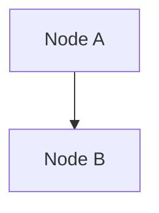

# Mermaid Code Extraction Fix

## Problem

After adding the post-processing Mermaid syntax validator, the system was failing with error:
```
"Invalid Mermaid diagram syntax - must start with a valid diagram type"
```

### Root Cause

The AI models return responses that include:
1. `<think>` tags with reasoning
2. `<explanation>` tags with system analysis
3. `<component_mapping>` tags with file mappings
4. Finally, the Mermaid diagram code in markdown code fences: ` ```mermaid ... ``` `

The old code was trying to remove the fence markers but **not extracting** the content between them. This meant the validator was checking the entire AI response (including thinking/explanation) instead of just the Mermaid code.

### Old Code (Broken)
```python
full_diagram = full_diagram.replace("```mermaid", "").replace("```", "")
```

This just removed the fence markers, leaving all the surrounding text.

## Solution

Implemented proper regex-based extraction to:
1. Find the markdown code fence (with or without `mermaid` keyword)
2. Extract **only** the content between the fences
3. Ignore all surrounding text (thinking, explanation, mapping)

### New Code (Fixed)
```python
# Extract Mermaid code from markdown code fence if present
mermaid_pattern = r'```(?:mermaid)?\s*\n(.*?)```'
mermaid_match = re.search(mermaid_pattern, full_diagram, re.DOTALL)

if mermaid_match:
    # Extract the content between code fences
    full_diagram = mermaid_match.group(1).strip()
    if DEBUG:
        print(f"[DEBUG] Extracted Mermaid code from markdown fence ({len(full_diagram)} chars)")
else:
    # No code fence found, try to remove fence markers if they exist
    full_diagram = full_diagram.replace("```mermaid", "").replace("```", "")
    if DEBUG:
        print(f"[DEBUG] No markdown fence found, cleaned fence markers")

# Additional check: if diagram is empty after extraction
if not full_diagram.strip():
    if DEBUG:
        print("[DEBUG] Diagram is empty after extraction")
    yield f"data: {json.dumps({'error': 'AI response did not contain valid Mermaid diagram code. Please try again.'})}\n\n"
    return
```

## How It Works

### Regex Pattern Breakdown
```
```(?:mermaid)?\s*\n(.*?)```
```

- ` ``` ` - Matches opening fence
- `(?:mermaid)?` - Optionally matches "mermaid" keyword (non-capturing)
- `\s*\n` - Matches whitespace and newline
- `(.*?)` - **Captures everything** between fences (non-greedy)
- ` ``` ` - Matches closing fence

### Example Extraction

**Input (AI Response):**
```
<think> Let me analyze... </think>
<explanation> This is a desktop app... </explanation>
<component_mapping>
1. Main: src/main/
</component_mapping>


```

**Output (Extracted):**
```
flowchart TD
    A["Node A"]
    B["Node B"]
    A --> B
```

## Testing

Created comprehensive test suite in `test_mermaid_extraction.py`:

✅ **Test 1**: Full AI response with thinking/explanation/mapping tags
✅ **Test 2**: Mermaid code with underscore arrows (extracted, then fixed by validator)
✅ **Test 3**: Plain code without fence (fallback to marker removal)
✅ **Test 4**: Code fence without 'mermaid' keyword
✅ **Test 5**: Complex real-world example with subgraphs and styles

All tests pass successfully.

## Benefits

1. **Robust Extraction**: Properly handles AI responses with extra content
2. **Flexible**: Works with or without `mermaid` keyword in fence
3. **Safe Fallback**: Falls back to marker removal if no fence found
4. **Better Debugging**: Logs extraction details in DEBUG mode
5. **Error Handling**: Detects empty diagrams after extraction

## Files Modified

- `backend/app/routers/generate.py` (Lines 302-323)
  - Added regex-based extraction
  - Added empty diagram check
  - Added debug logging

## Integration with Validator

The extraction happens **before** the validator runs:

```
AI Response → Extract Mermaid Code → Validate & Fix Syntax → Process Click Events → Return to User
```

This ensures the validator only sees pure Mermaid code, not the surrounding AI reasoning.

## Verification

To verify the fix is working:

1. Enable DEBUG mode: `DEBUG=true` in environment
2. Generate a diagram
3. Check logs for: `[DEBUG] Extracted Mermaid code from markdown fence (XXX chars)`
4. Verify no "Invalid Mermaid diagram syntax" errors

## Related Fixes

This fix works in conjunction with:
- Underscore arrow syntax fixes (see `UNDERSCORE_ARROW_FIX.md`)
- Post-processing validation (in `app/utils/mermaid_validator.py`)
