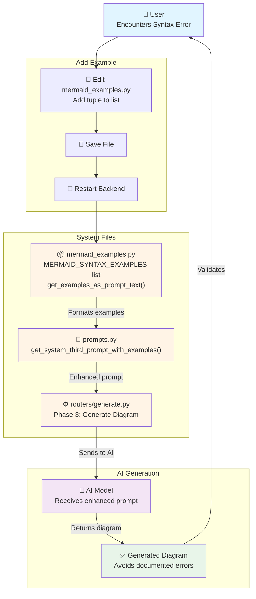
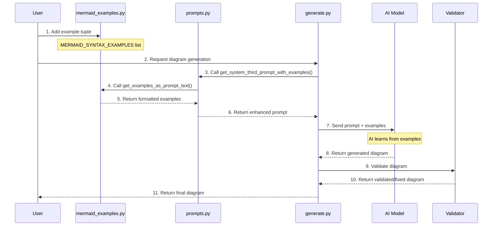
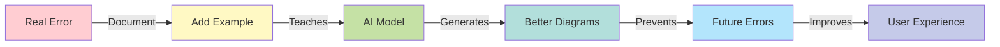
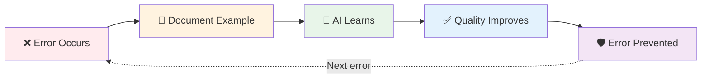

# Mermaid Examples System - Visual Overview

## System Flow



## File Structure

```
gitdiagram/
├── backend/app/
│   ├── mermaid_examples.py          ⭐ ADD EXAMPLES HERE
│   │   ├── MERMAID_SYNTAX_EXAMPLES  (list of tuples)
│   │   ├── get_examples_as_prompt_text()
│   │   ├── get_examples_count()
│   │   └── add_example()
│   │
│   ├── prompts.py                   🔗 USES EXAMPLES
│   │   ├── SYSTEM_FIRST_PROMPT
│   │   ├── SYSTEM_SECOND_PROMPT
│   │   ├── SYSTEM_THIRD_PROMPT
│   │   └── get_system_third_prompt_with_examples()  ← NEW
│   │
│   ├── routers/generate.py          🔗 APPLIES EXAMPLES
│   │   └── Phase 3: Uses get_system_third_prompt_with_examples()
│   │
│   ├── utils/mermaid_validator.py   ✓ VALIDATES OUTPUT
│   │   ├── validate_and_fix_mermaid()
│   │   └── get_validation_report()
│   │
│   ├── EXAMPLES_README.md           📖 FULL GUIDE
│   ├── QUICK_ADD_EXAMPLE.md         📖 QUICK START
│   └── example_template.txt         📋 TEMPLATES
│
├── EXAMPLES_SYSTEM_SUMMARY.md       📖 TECHNICAL OVERVIEW
└── HOW_TO_ADD_EXAMPLES.md           📖 USER GUIDE
```

## Data Flow



## Example Structure

```python
# In mermaid_examples.py

MERMAID_SYNTAX_EXAMPLES = [
    (
        # 1. Description
        "Brief description of error type",
        
        # 2. Incorrect Code
        """flowchart TD
    BadNode[Label]
    BadNode --> Other""",
        
        # 3. Correct Code
        """flowchart TD
    GoodNode["Label"]
    GoodNode --> Other""",
        
        # 4. Explanation
        "Why it fails and how to fix it"
    ),
    # ... more examples ...
]
```

## How Examples Appear in Prompts

```
SYSTEM_THIRD_PROMPT (grammar rules)
+
**COMMON SYNTAX ERRORS AND CORRECTIONS:**

**Example 1: [Description]**
❌ INCORRECT:
```
[bad code]
```
✅ CORRECT:
```
[good code]
```
💡 Why: [explanation]
---

**Example 2: ...**
[repeat for all examples]
```

## Integration Points

### 1. Import in prompts.py
```python
from app.mermaid_examples import get_examples_as_prompt_text
```

### 2. Function in prompts.py
```python
def get_system_third_prompt_with_examples() -> str:
    return SYSTEM_THIRD_PROMPT + "\n\n" + get_examples_as_prompt_text()
```

### 3. Usage in generate.py
```python
system_prompt_with_examples = get_system_third_prompt_with_examples()
async for chunk in service.call_api_stream(
    system_prompt=system_prompt_with_examples,  # ← Enhanced with examples
    ...
)
```

## Quick Actions

| Action | Command/File |
|--------|-------------|
| **Add Example** | Edit `backend/app/mermaid_examples.py` |
| **View Examples** | Run `get_examples_as_prompt_text()` |
| **Count Examples** | Run `get_examples_count()` |
| **Restart Backend** | `docker-compose restart backend` |
| **Test Changes** | Generate a diagram |
| **Read Guide** | Open `EXAMPLES_README.md` |
| **Quick Start** | Open `QUICK_ADD_EXAMPLE.md` |
| **Copy Template** | Open `example_template.txt` |

## Benefits Visualization



## Continuous Improvement Loop



---

## Summary

This system creates a **feedback loop** where:
1. Real errors are documented as examples
2. Examples are automatically included in AI prompts
3. AI learns to avoid documented mistakes
4. Diagram quality continuously improves
5. Fewer errors occur over time

**Start adding examples today!** 🚀
